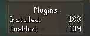
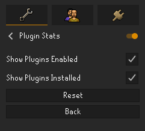

# Plugin Stats
This is a simple runelite plugin that shows the amount of plugins activated and enabled in-game.

## Configuration
The plugin does not require any configuration, the counts displayed on screen will change whenever a plugin is activated/deactivated or installed/uninstalled.

### Plugin Settings:
- Show Plugins Installed (toggle)
- Show plugins Enabled (toggle)

